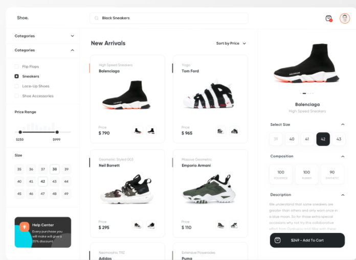
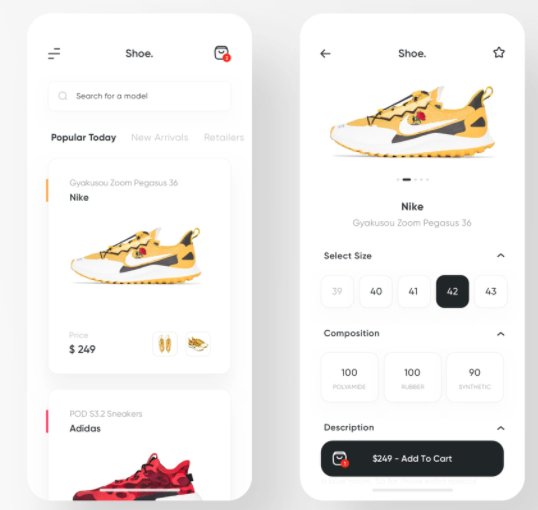
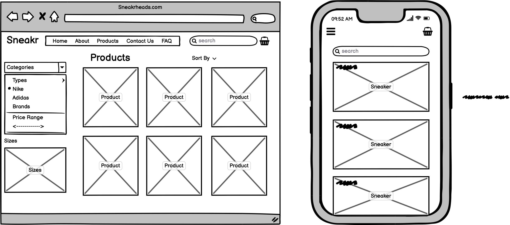
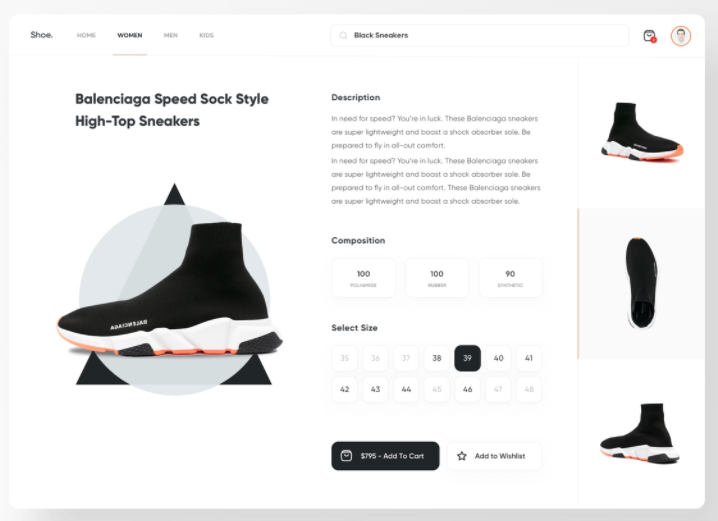
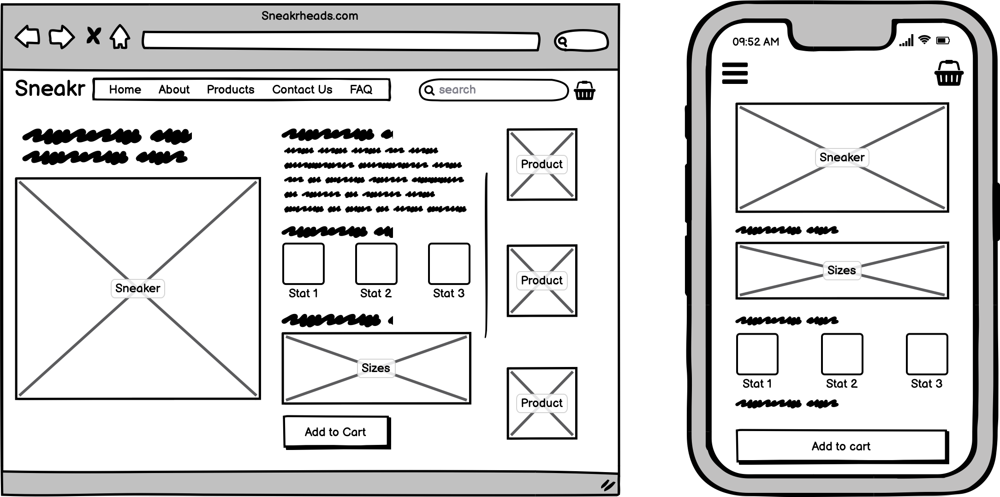
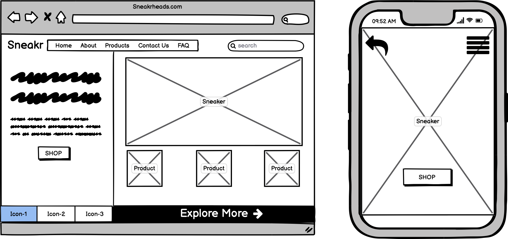
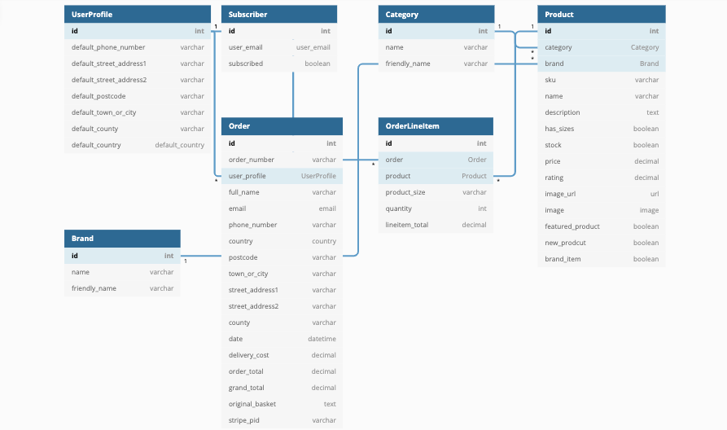

# SneakrHeads - Sneakers and Sport Shoes E-commerce Store

"SneakrHeads" is a sports-fashion e-commerce website that allows shoppers to browse, search for and purchase the most popular sneakers and trainers. 

The project aims to build a website on the Django Framework for improved security and speedy development. It allows user's to register an account and log in to review their orders. Additionally, the website will record the the customer's cart so as to allow them to view their next potential purchases. Furthermore, the site will also utilise the stripe API in order to assist customer's with finalising their purchase and securely save their payment information for future orders.

<strong>Admin Login Details: </strong>

<strong>Username:</strong> wyneyban <br>
<strong>Password:</strong> 0891

The website is deployed here: https://wyne-sneakrhead.herokuapp.com/

** <strong>Educational Purposes Only</strong> **

## Table of Contents

* [User Experience Design (UX)](#User-Experience-Design)
    * [The Strategy Plane](#The-Strategy-Plane)
        * [Site Goals](#Site-Goals)
        * [User stories](#User-Stories)
    * [The Scope Plane](#The-Scope-Plane)
    * [The Structure Plane](#The-Structure-Plane)
    * [The Skeleton Plane](#The-Skeleton-Plane)
        * [Wireframes](#Wireframes)
        * [Database Design](#Database-Design)
        * [Database Security](#Security)
    * [The Surface Plane](#The-Surface-Plane)
        * [Design](#Design)
            * [Colour Scheme](#Colour-Scheme)
            * [Typography](#Typography)
* [Features](#Features)
    * [Existing Features](#Existing-Features)
    * [Future Features](#Room-for-improvement)
* [Technologies](#Technologies)
* [Testing](#Testing)
    * [Test Strategy](#Test-Strategy)
    * [Test Results](#Test-Results)
* [Deployment](#Deployment)
    * [Deployment to Heroku](#Project-Creation)
    * [GitHub Pages](#Deployment-To-Heroku)
    * [Local Clone](#Local-Clone)
    * [Fork Project](#Fork-Project)
* [Credits](#Credits)
  * [Content](#Content)
  * [Media](#Media)
  * [Code](#Code)
  * [Acknowledgements](#Acknowledgements)

## User Experience Design

### **The Strategy Plane**

The main target audience of the website are online shoppers particularly those who are into sports brands, trainers and sneakers. 
The site will implement a header image of a popular sports brand's trainers and this will communicate what the site is about, an e-commerce store for sneakers. The website allows like minded sneaker fans to search, purchase and create an account. 

The store will utilise and effective navigation and search functionality so as to assist potential buyers with viewing and browsing. This strategy will also allow established users to easily view products they may want to purchase. The site will also utilise a shopping basket functionality. Where the user will be notified every time they add an item to their basket. This basket will also be easily accessible so as to allow the user to find out what they have placed in their basket and encourage them to checkout. 

#### Site Goals

- To bring together 'Sneaker Heads', shoppers and users who are fanatic about getting branded and popular trainers/sneakers.
- To allow these shoppers to create a profile, track their orders and purchase remotely. 
- To allow the shop owner to scale their business easily and earn profits.

### User stories: 

#### Shopper
##### View and Navigation

- As a shopper, I would like to view a list of Products
- As a shopper, I would like to view a specific category of products
- As a shopper, I would view individual product details
- As a shopper, I would like to quickly identify deals and special offers
- As a shopper, I would like to easily view the total of my purchases at any time

##### Sorting and Searching

- As a shopper, I would like to sort the list of available products 
- As a shopper, I would like to sort a specific category of products
- As a shopper, I would like to search for a product by name or description 
- As a shopper, I would like to easily see what I’ve searched for and the number of results

##### Purchasing and Checkout 

- As a shopper, I would like to easily select the size and quantity of a product when purchasing it
- As a shopper, I would like to view items in my bag to be purchased
- As a shopper, I would like to adjust the quantity of individual items in my bag
- As a shopper, I would like to easily enter my payment information
- As a shopper, I would like to feel my personal and payment information is safe and secure
- As a shopper, I would like to view an order confirmation after checkout
- As a shopper, I would like to receive an email confirmation after checking out

#### Site User
##### Registration and User Accounts

- As a User, I would like to easily register for an account
- As a User, I would like to easily login or logout 
- As a User, I would like to easily recover my password in case I forget it
- As a User, I would like to receive an email confirmation after registering
- As a User, I would like to have a personalised user profile

#### Shop Owner/Admin
##### Admin and Store Management

- As the site owner, I would like to add products to the store
- As the site owner, I would like to edit/update a product
- As the site owner, I would like to delete a product 
- As the site owner, I would like to have the ability to delete a user's account

### **The Scope Plane**

**Features planned:**

- Responsive UI/UX
- Website purpose immediately communicated and understood
- Navigation bar 
- Side-Nav Sorting functionality
- Registration & Login functionality 
- Search functionality
- Log out functionality 
- Sorting functionality
- Product details 
- Checkout functionality 
- Contact form

### **The Structure Plane**

The website incorporates a minimal design and a multi-page experience. The user will be enticed to explore the e-commerce website as if it was a real life store, conveying products from the get go. Every section will lead to a relevant, clear and complimentary section which is designed to maintain the user's interest, inform them of their position in the purchase process. Most importantly, it should capture their interest at every stage. The experience should be seamless and at no point in time should the user feel lost.

### **The Skeleton Plane**
#### Wireframes/Web Design

The design for the website derived from Dribble. Particularly the design 'Shoe.' by Dmitriy Kharaberyush. 
Here is a link to Dmitriy's design - [Design](https://dribbble.com/shots/14866237-Shoe-Ecommerce-Sneakers-Shop)

- Products Page: <br>
 <br>
 <br>


- Product Details Page: <br>
 <br>
 <br>

- Home/Landing Page Original conception: <br>
 

<strong>The following main pages will be implemented:</strong>

- Base Page - base.html
    - Will contain components such as navigation bar, headers
    - allAuth
- Sign Up Page - register.html
- Sign In Page - login.html
- Home page - index.html
    - Displays all products - products.html
- Product Details - product_detail.html
- Member Profile Page - profile.html
- User's basket - basket.html
    - Requires templatetags - baskettools
- Admin Product Management
    - Add Product Page - add_product.html
    - Edit Product Page - edit_product.html
- Checkout Page - checkout.html
    - With order summary if checkout successful - checkout_success.html
- Error 404 - 404.html (error 404 handling)
- Error 500 - 500.html (error 500 handling)

### Database Design 



**Table UserProfile** { <br>
  id int [pk] <br>
  default_phone_number **varchar** <br>
  default_street_address1 **varchar** <br>
  default_street_address2  **varchar** <br>
  default_postcode **varchar** <br>
  default_town_or_city **varchar** <br>
  default_county **varchar** <br>
  default_country **country** <br>
}

**Table Subscriber** { <br>
  id int [pk] <br>
  user_email **user_email** <br>
  subscribed **boolean** <br>
}

**Table Category** { <br>
  id int [pk] <br>
  name **varchar** <br>
  friendly_name **varchar** <br>
}

**Table Product** { <br>
  id int [pk] <br>
  category **Category [ref: > Category.id]** <br>
  brand Brand **[ref: > Brand.id]** <br>
  sku **varchar** <br>
  name **varchar** <br>
  description **text** <br>
  has_sizes **boolean** <br>
  stock **boolean** <br>
  price **decimal** <br>
  rating **decimal** <br>
  image_url **url** <br>
  image **image** <br>
  featured_product **boolean** <br>
  new_prodcut **boolean** <br>
  brand_item **boolean** <br>
}

**Table Brand** { <br>
  id int [pk] <br>
  name **varchar** <br>
  friendly_name **varchar** <br>
}

**Table Order** { <br>
  id int [pk] <br>
  order_number **varchar** <br>
  user_profile **UserProfile [ref: > UserProfile.id]** <br>
  full_name **varchar** <br>
  email **email** <br>
  phone_number **varchar** <br>
  country **country** <br>
  postcode **varchar** <br>
  town_or_city **varchar** <br>
  street_address1 **varchar** <br>
  street_address2 **varchar** <br>
  county **varchar** <br>
  date **datetime** <br>
  delivery_cost **decimal** <br>
  order_total **decimal**<br>
  grand_total **decimal** <br>
  original_basket **text** <br>
  stripe_pid **varchar** <br>
}

**Table OrderLineItem** { <br>
  id int [pk] <br>
  order **Order [ref: > UserProfile.id]** <br>
  product **Product [ref: > Product.id]** <br>
  product_size **varchar** <br>
  quantity **int** <br>
  lineitem_total **decimal** <br>
}

** Created from dbdiagram.io **

#### Database Security

The website takes advantage of Django's security features to protect all data that is inputted and stored within the site. It does so through the features of a superuser, who can manipulate data through the administrator's page. 

It utilises CSRF protection so as to ensure that forms are validated and secure. It checks for a secret within each POST request. Thus, ensures that a malicious actor can't POST to the site and have another logged in user unwittingly submit that form.

The site also uses Host header validation: Django validates Host headers against the ALLOWED_HOSTS setting in the django.http.HttpRequest.get_host() method. (https://docs.djangoproject.com/en/3.2/topics/security/)

Additionally, the site exploits Amazon's AWS S3 which provides server-side encryption (SSE) for uploaded static images within the site.

Database security is also maintained through the workspace environment through the following command `export VARIABLE = VARIABLE VALUE` or by going to gitpod and changing the environment variables manually. During development, these variables are then accessed through the local environment which ensures that the configuration files are not stored in github. For production, the configuration details are placed into the app settings and Heroku variables instead.

### **The Surface Plane**
### Design

#### Colour Scheme

#212529 - Bootstrap Dark

#F8F9FA - Bootstrap Light

#0DCAF0 - Bootstrap Info 

#FF6347 - Tomato

#20C997 - Light Green

#### Typography

The main typography used for the website is 'Caveat' for the home/landing page. 'Prompt' for headings and 'Roboto' for other minor texts. These all derive from Google Fonts. 

## Features

### Existing Features

- Home page/Landing Page which contains a hero image, the New Arrivals with product cards and an action button to quickly go shopping
- Registration feature which allows users to sign up and create an account
- Log in Feature which allows users to sign into their account
- Search functionality which is on the navbar on medium to large screens. This is also available to smaller devices in the products.html page
- Products research - the site allows shoppers to view the product description prior to purchasing
- Category and Brands search functionality which allows users to search for products based on the Brand and Category
- Profile page which shows user's orders and delivery information
- Products modification - the website allows the site owner to add, update or delete products
- Responsive on different media screens.
- Admin dashboard provided by Django which allows the admin to view website statistics and manipulate site data
- Horizontal Product display feature which shows the designated featured products as chosen by the site owner.
- Website and Data security with every form submission.
- A shopping basket feature which stores the shopper's desired products and respective quantities prior to completing the checkout process. 
- Checkout level which assists user's with payments and keeping their billing information secure.

### Future Implementations & Room for Improvement

- The Categories/Products grid was initially utilised to assist customers/users with accessing certain products through an image grid. For this purpose of this project, the grid was focused primarily on front-end and did not contain any backend. Hence, it has been removed for assessment and will be refined and re-added.

- In future I would like to allow customers to contact the store owners through a contact form. 

- I would like to add more content such as products and images in the AWS S3 bucket for the use of this project.

- The basket page does not look appealing on mobiles phones or on small devices. In future, I would like to refactor the code on this page so as to improve the look and style of the mobile display for the page.

- In future I would like to fine tune this project even further and ensure that it passes Pep8/Flake 8, W3C HTML, CSS and JS Hint validators. At the moment the project still has many errors regarding best practices and validation.

- Refine the sizing logic and parameters for certain products such as socks or shoes e.g size UK 9.5. 

- Have a model for stock and refine stock logic, decreasing stock for every successful checkout.

- Images should be added for the README.md displaying the look of certain pages as described in the user stories and implementation.

****
## Technologies

- [HTML](https://en.wikipedia.org/wiki/HTML)
    - The website incorporates HTML as the base structure for the pages.

- [CSS](https://en.wikipedia.org/wiki/CSS)
    - The project uses CSS to style and design the website.

- [Bootstrap v5.0](https://getbootstrap.com/) 
    - Bootstrap was used for website design and website responsiveness.

- [JavaScript](https://developer.mozilla.org/en-US/docs/Web/JavaScript)
    - Used for overall site interactivity.

- [jQuery](https://jquery.com/)
    - Used for overall site interactivity and animation.

- [Python](https://www.python.org/)
    - Python was used to create and run the back-end logic of the website.
    - Python modules used (as stated in requirements.txt)

- [Django](https://www.djangoproject.com/)
    - Django was the web framework used for rapid development, security and scalability.

- [Google Fonts](https://fonts.google.com/)
    - Roboto was the main font used for this project, and this derived from Google Fonts

- [Google Chrome Developer Tools](https://developers.google.com/web/tools/chrome-devtools)
    - This was used to inspect the website and help debug styling issues and test for grid layouts.

- [GitHub](https://github.com/)
    - This was used to store the scource code for the website.

- [Git](https://git-scm.com/)
    - Git was used for version control during development where code was committed and pushed to the project's Github repository.

- [Heroku](https://dashboard.heroku.com/apps)
    - Heroku was used in this project to deploy the project and use postgresSQL to manipulate and interpret the data.

- [Balsamiq Wireframes](https://balsamiq.com/wireframes/)
    - This was used to create wireframes prior to the project having been developed.

- [TinyPNG](https://tinypng.com/)
    - This was used to reduce the file sizes of the images used in the project.

- [AWS: Amazon Web Services](https://aws.amazon.com/)
    - Used the S3 bucket to contain, serve and keep static images durable.

****
## Testing

### Test Strategy
#### **Summary**
Testing is to be made to ensure all features of the website is working as intended and that the links lead to the appropriate pages. Tests must be made to judge the websites responsiveness. Additionally, that all inputs done through the forms must submit the data to the appropriate collections. It is also there to ensure the project's code structure abides the universal best practices for programming. The following validators are planned to be used.

HTML Code must pass through the [W3C HTML Validator](https://validator.w3.org/#validate_by_uri).

CSS Code must pass through the [W3C CSS Validator](https://jigsaw.w3.org/css-validator/).

JavaScript code must pass through the [JSHint Validator](https://jshint.com/).

Python Code must pass through [PEP8 Validator](http://pep8online.com/)

### Test Results

Test Results are documented through [this link](TESTING.md)

## Deployment

### Project Creation

- Project started using Github and Gitpod.

1. First I signed into Github and created a new repository. There will be a drop down menu when looking to use a template
    so I chose to use Code Institute's Template. Alternatively, you can [navigate here](https://github.com/Code-Institute-Org/gitpod-full-template)
    and there will be an option button called "Use this template".

2. I then clicked the use this template button. Where I was directed to create a new repository name and create a new 
    repository which I could open using Gitpod.

3. It creates a Gitpod workspace of which I could start developing the project.

### Local Deployment

To deploy the project locally, the following commands were used:

1. 

### Version Control 

In the terminal, I utilised the following commands in the following order:

- git add . (git add <em>filename</em>) - command to add all files or a specific file 
- git commit -m <em>commit message</em> - command to commit the changes locally with a message to describe the changes briefly
- git push - command to push changes to remote Github repository

### Deployment to Heroku
**Create application:**

1. I signed into Heroku 
2. I created a new app by clicking the "new" button.
3. Select the new app 
4. Create an app project name 
5. Selected Europe as the region

**Set up connection to Github Repository:**

1. A requirements.txt needs to be created, this can be done through the following terminal command
    >  pip3 freeze --local > requirements.txt

2. Then a Procfile for Heroku is needs to be created, here is the terminal command used
    >  echo web: python app.py > Procfile

3. Ensure there the Procfile begins with a capital letter 'P' and that there are no unecessary spaces 

4. Click the deploy tab and select Github - connect to Github

5. There will be an empty input field where you can type the name of your repository. Write the repo name there and 
    click search

6. Once the repository has been found, click the connect button

**Set environment variables:**

- 

<strong>Example:</strong>

- 

**Enable Automatic Deployment & Manual Deployment:**

- Ensure your Procfile and requirements.txt are in your repository as Heroku will not be able to deploy without these
- Click the Deploy tab
- Click Enable Automatic deploys in 'Automatic Deploys' section
- Choose the branch you would like to deploy and click "Deploy Branch"

### Local Clone

**Note: To run this project locally...**

This is used when you would like to make changes to the project code

1. Should you wish to use a different IDE like VSCode. You first log in to Github and locate the required repository. Here is the link for this [repository](https://github.com/wyne-ybanez/SneakrHead)
2. Open a new terminal on Git Bash
3. Type `git clone`, and then paste the URL you copied 

```
$ git clone https://github.com/wyne-ybanez/SneakrHead
```

 Here is a link that can explain this process further. [Click Here](https://help.github.com/en/github/creating-cloning-and-archiving-repositories/cloning-a-repository#cloning-a-repository-to-github-desktop)

### Fork Project 

You can fork the repository through the following steps. Forking the repository means you will have a copy of the repository and any changes you make will not affect the original repository.

1. Log in to GitHub and locate the GitHub Repository. Here is a link for the [repository](https://github.com/wyne-ybanez/SneakrHead)
2. At the top of the Repository (not top of page) just above the "Settings" Button on the menu. Looking towards the right of the page. Locate the button "Fork" then click 
3. You should now have a copy of the original repository in your GitHub account.

****
## Credits

### Content

- Content from the footer of 'FP Vision' was used and repurposed for project- [Link](https://fpvision.herokuapp.com/)
- Descriptive sneaker content and images from the Nike e-commerce store was used in the project - [Nike](https://www.nike.com/ie/)
- Descriptive Content and images from Foot Asylum website was also used for the project - [Foot Asylum](https://www.footasylum.com/ie/)

### Media 

- Nike Store shoes - Here is a link to [Nike](https://www.nike.com/ie/)
- FootAsylum product images from online store - [FootAsylum](https://www.footasylum.com/ie/)
- An Unsplash sneaker image was used for the home page background image - Here is a link to [Unsplash](https://unsplash.com/)

### Code

- Rotate Code for chevrons in navigation bar: https://codepen.io/rezk/pen/PegNRY 

- Footer Code Snippet from: https://mdbootstrap.com/docs/standard/navigation/footer/

- Dividers Code from Wrennas Project: https://fpvision.herokuapp.com/

- Horizontal Scrolling Code Solution: https://codeburst.io/how-to-create-horizontal-scrolling-containers-d8069651e9c6

- Horizontal button scrolling code solution: https://stackoverflow.com/questions/56932831/how-to-scroll-right-on-a-button-click

- Overlay images hover solution: https://www.w3schools.com/howto/tryit.asp?filename=tryhow_css_image_overlay_fade

- Hover Animation on link: https://github.com/IanLunn/Hover/blob/master/css/hover.css

- JavaScript Interactive price range display: https://stackoverflow.com/questions/18544890/onchange-event-on-input-type-range-is-not-triggering-in-firefox-while-dragging

- Solution for registering template tag particularly for basket tools: https://stackoverflow.com/questions/68149422/templatesyntaxerror-apptags-is-not-a-registered-tag-library

- Core logic/payment flow for this comes from here: https://stripe.com/docs/payments/accept-a-payment

- Stripe CSS from here: https://stripe.com/docs/stripe-js

- Kotaro Tanaka's Eagle Golf Newsletter code and Shoe Brands Logic code repurposed for this project: https://github.com/Toto-Kotaro-Tanaka/ms4-eagle-golf

- ReadME structure used from my MS3 Data Centric Project: https://github.com/wyne-ybanez/PaperCut/tree/main

### Acknowledgements

I would to express my gratitude to the Code Institute tutors and community for helping get this far.

Nike's website and JD Sports Website were used as an inspiration for the design of this website. 

I would also like to acknowledge the 'FP vision' project by Wrenna for inspiring the design of the e-commerce store. I would also like to highlight Code Institute's 'Boutique Ado' project which was used as a foundation tutorial for this project.

Finally, I would like to thank my Mother and Girlfriend for supporting me and keeping me focused during the development of this project.


